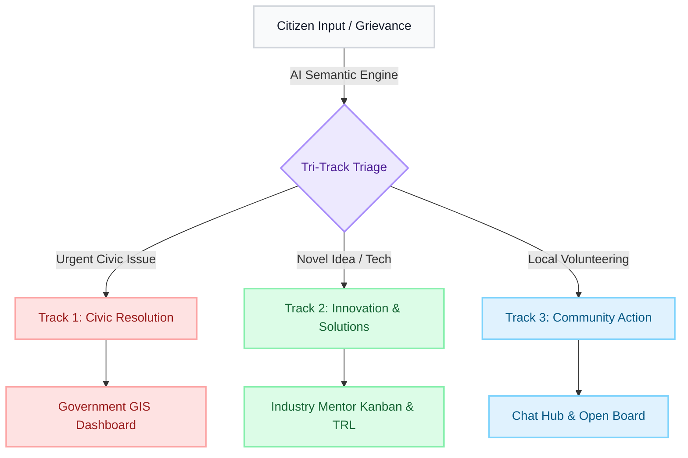
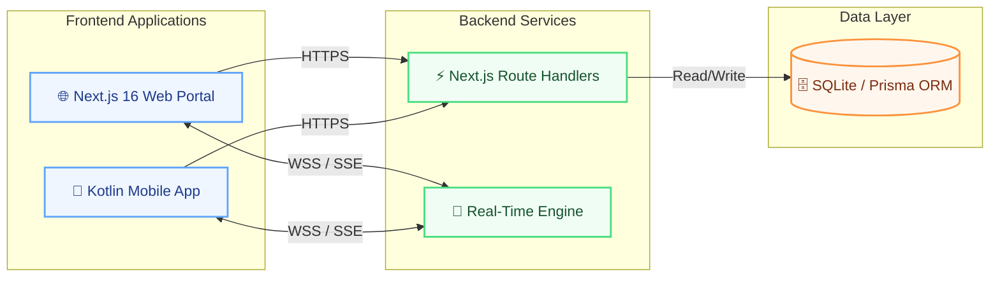

<div align="center">
  
  
  <h1 align="center">PRAGATI <span>(Jan-Aawaz)</span></h1>
  
  <p align="center">
    <strong>The Next-Generation Tri-Track Triage Platform for Civic Problem Solving</strong>
  </p>

  <p align="center">
    <a href="https://github.com/PRAGATI/SIH26043">
      
    </a>
    <a href="https://nextjs.org/">
      
    </a>
    <a href="https://kotlinlang.org/">
      
    </a>
    <a href="https://www.sqlite.org/">
      
    </a>
  </p>
  
  <p align="center">
    <em>Bridging the gap between <b>Citizens</b>, <b>Government</b>, and <b>Industry Mentors</b> through real-time collaboration, GIS-driven tracking, and TRL-based innovation.</em>
  </p>
</div>

<hr />

## 📖 Table of Contents

- [🚀 The Vision](#-the-vision)
- [✨ Core Innovations](#-core-innovations)
- [🛤️ Tri-Track Triage System](#️-tri-track-triage-system)
- [🏗️ Technical Architecture](#-technical-architecture)
- [🎯 Impact & Value Proposition](#-impact--value-proposition)
- [🛠️ Getting Started](#️-getting-started)

## 🚀 The Vision

In the modern civic landscape, disjointed communication often leads to delayed problem resolution and stalled innovations. **PRAGATI (Jan-Aawaz)** represents a paradigm shift. We’re not just building an app; we are constructing a comprehensive ecosystem that triages civic issues into three distinct tracks, ensuring that every problem finds its precise solver, every innovation finds its mentor, and every action is fully transparent. 

Built for scale, impact, and unprecedented efficiency, **PRAGATI** is engineered to impress and designed to deliver.

## ✨ Core Innovations

<table align="center" width="100%">
  <tr>
    <td align="center" width="33%">
      
      <br />
      <b>AI-Powered Ingestion</b>
    </td>
    <td align="center" width="33%">
      
      <br />
      <b>GIS Dashboard & Triage</b>
    </td>
    <td align="center" width="33%">
      
      <br />
      <b>Industry Mentor Kanban</b>
    </td>
  </tr>
  <tr>
    <td valign="top">
      <ul>
        <li><b>Omnichannel:</b> Submit via Web, Mobile App, or a <i>WhatsApp Simulator</i>.</li>
        <li><b>Rich Media:</b> GPS geo-tagging, photos, video, and voice notes.</li>
        <li><b>Semantic AI:</b> Google Gemini NLP deduplicates & categorizes automatically.</li>
      </ul>
    </td>
    <td valign="top">
      <ul>
        <li><b>Geospatial Analytics:</b> Interactive maps for hotspots across 24 districts.</li>
        <li><b>Human-in-the-loop:</b> Nodal Officers seamlessly validate and route dockets.</li>
      </ul>
    </td>
    <td valign="top">
      <ul>
        <li><b>TRL Integration:</b> Track Technology Readiness Levels (TRL 1-9).</li>
        <li><b>Interactive CAD:</b> Mentors review and approve milestone deliverables.</li>
        <li><b>CSR Escrow:</b> Automated milestone-based fund releases.</li>
      </ul>
    </td>
  </tr>
</table>

<details>
<summary><b>💬 View More Features: Chat Hub, Architecture & Compliance</b></summary>
<br/>

- **📱 Jan-Aawaz / PRAGATI Lens Mobile App:** A beautifully crafted Kotlin Multiplatform (KMP) mobile app ensuring that the power of PRAGATI is always in the citizens' hands with on-the-go reporting and field verification.
- **💬 Real-Time Chat Hub & Open Board:** Secure messaging connecting citizens directly with officials and mentors, plus a public forum for university researchers to pick up Micro-Tasks.
- **🛠️ Robust Architecture (44+ API Routes):** Powered by over 44 meticulously designed API routes handling everything from Account Handover cryptographic tokens to Tri-Track state management.
- **📜 Policy Compliance:** 100% aligned with NEP 2020 (experiential learning) and the Digital India vision.

</details>

## 🛤️ Tri-Track Triage System

Our intelligent routing mechanism immediately categorizes civic input into one of three actionable tracks:



1. 🔴 **Track 1: Civic Resolution (Government)** – For immediate civic problems (potholes, water supply, etc.).
2. 🟢 **Track 2: Innovation & Solutions (Industry)** – For novel ideas requiring technical mentorship or funding.
3. 🔵 **Track 3: Community Action (Citizens)** – For local crowdsourced initiatives and volunteering.

## 🏗️ Technical Architecture

We have engineered PRAGATI using a highly scalable and performant technology stack. 

### Core Tech Stack
| Domain | Technologies |
| :--- | :--- |
| **Frontend / Web** | Next.js 16.3.4 (App Router), Tailwind CSS v4 |
| **Frontend / Mobile** | Kotlin Multiplatform (KMP), Compose Multiplatform |
| **Backend / API** | Next.js Serverless Route Handlers, Node.js |
| **Database Layer** | SQLite, Prisma ORM (with immutable audit ledger) |
| **Real-Time Layer** | Optimized DB polling & Server-Sent Events |

### Architecture Flow



> *(For detailed architectural flows, please see `architecture_flow.md`)*

## 🎯 Impact & Value Proposition

PRAGATI isn't just another grievance portal. It is a **proactive civic engine**. 
By integrating TRL tracking for innovation and GIS for physical infrastructure, we deliver targeted value to all stakeholders:

> **🏛️ For Government**  
> Saves time and resources via targeted interventions and spatial data analytics.

> **👥 For Citizens**  
> Ensures they feel heard, empowered, and directly involved in community development.

> **🏢 For Industry Leaders**  
> Provides a streamlined, transparent pipeline of grassroots innovations ready for mentorship and targeted CSR funding.

**We are redefining civic engagement. Welcome to the future of Jan-Aawaz.**

## 🛠️ Getting Started

### Prerequisites
Make sure you have the following installed before proceeding:
- **Node.js** (v18+)
- **Java JDK 17** (for Mobile)
- **Android Studio / Emulator**

### Installation & Execution

**1. Clone the repository**
```bash
git clone https://github.com/PRAGATI/SIH26043.git
cd SIH26043
```

**2. Start the Web Portal (Next.js)**
```bash
cd web
npm install
npm run dev
# The server will run at http://localhost:3000
```

**3. Build the Mobile App (Kotlin Multiplatform)**
```bash
cd ../mobile
# Ensure JAVA_HOME points to JDK 17
./gradlew assembleDebug
# The APK will be generated in: androidApp/build/outputs/apk/debug/
```

<hr />

<div align="center">
  <i>"Empowering Voices, Engineering Solutions."</i><br>
  <b>Team PRAGATI</b>
  <br/><br/>
  <p>
    
    
  </p>
</div>
